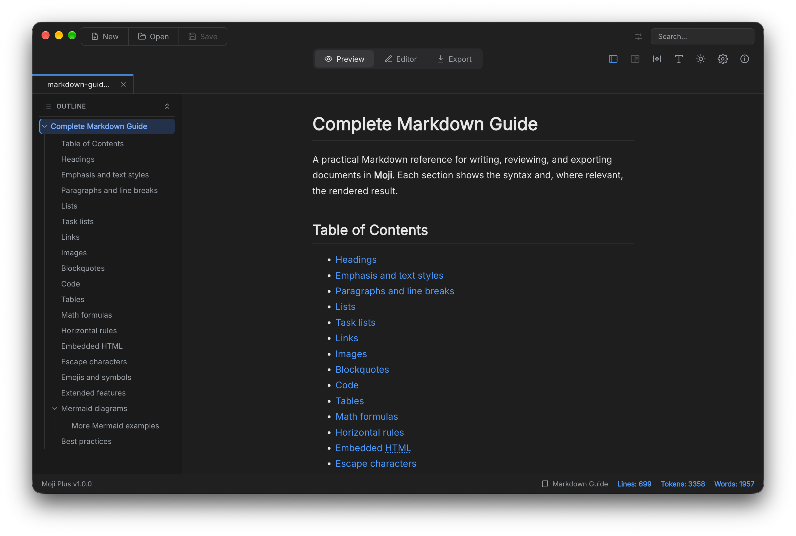

<p align="center">
  
</p>

<h1 align="center">Moji Plus</h1>

<p align="center">A lightweight, clean desktop app for opening, reading, editing, and exporting Markdown files.</p>

<p align="center"><strong>Current version:</strong> v1.0.2 · based on Moji v1.0.7</p>

> **Moji Plus is a derivative of [Moji](https://github.com/alexishida/Moji), created by [Alex Ishida](https://github.com/alexishida) and distributed under the MIT License.**
> It keeps receiving the changes made to the original project and adds its own changes, maintained independently.
> All credit for the original application goes to its author. See [CREDITS.md](CREDITS.md).

<p align="center">
  
</p>

<p align="center">
  <strong>Download:</strong>
  <a href="https://github.com/jacbmelo/Moji/releases/latest">GitHub Releases (jacbmelo/Moji)</a>
</p>

## Differences from the original Moji

Moji Plus has its own name, version, and releases, and installs next to the original Moji without sharing settings or recovery drafts.

| | Moji | Moji Plus |
|---|---|---|
| Repository | [alexishida/Moji](https://github.com/alexishida/Moji) | [jacbmelo/Moji](https://github.com/jacbmelo/Moji) |
| App ID | `com.alexishida.moji` | `com.jacbmelo.mojiplus` |
| Settings directory | `moji` | `moji-plus` |
| Updates | alexishida/Moji releases | jacbmelo/Moji releases |

Features added in Moji Plus, on top of the original:

- **App-wide light and dark themes**: chrome, editor, dialogs, and preview follow the OS theme by default. The top-bar toggle switches between light and dark, and Settings > General has a Theme option (System / Light / Dark). Exports always use the light theme.
- **YAML front matter**: a `---` … `---` block at the top of a document renders as a highlighted YAML code block in the preview and in exports.
- **No native title bar**: the top bar fills the top of the window and keeps the native window controls.
- **Session restore**: on launch, Moji Plus reopens the tabs from last time, in the same order. Unsaved changes to files are kept like untitled documents, so quitting does not ask and they come back as they were. Settings > General has separate options for keeping new documents and unsaved changes between sessions, and for reopening files without changes.
- **Layout restore**: the app reopens in preview or editor mode as it was left, with the outline, full width, and maximized window as they were. Each document also returns to where it was read, after switching tabs or restarting.
- **Unsaved-changes mark follows the text**: undoing every edit, so the text matches the saved version again, clears the mark.
- **External change detection**: when another app changes an open file, Moji Plus reloads it automatically if it has no unsaved edits; otherwise, or when the file is deleted, it offers to reload, save under another name, or keep your version. Saving never overwrites a change made elsewhere without asking.

Every change specific to Moji Plus is listed in [CHANGELOG.md](CHANGELOG.md).

## Features

Moji Plus includes every feature of the original Moji: split preview and editing, outline navigation, search and replace, Mermaid diagrams, KaTeX math, a localized UI in 15 languages, and export to PDF, HTML, and PNG. The full description of the original application and its screenshots are in the original README, kept in [docs/upstream/README.md](docs/upstream/README.md).

## Installation

Download the file for your system from [GitHub Releases](https://github.com/jacbmelo/Moji/releases/latest). Moji Plus installs next to the original Moji: the two apps use separate settings and never overwrite each other.

| System | File |
|---|---|
| macOS (Apple silicon and Intel) | `Moji-Plus-<version>-universal.dmg` |
| Windows (x64) | `Moji-Plus.Setup.<version>.exe` |
| Linux (x64) | `Moji-Plus-<version>-x86_64.AppImage` or `Moji-Plus-<version>-amd64.deb` |

### macOS

The app is not signed with an Apple Developer ID, so macOS blocks it the first time and may say it is damaged or cannot be checked. The app is fine.

1. Open the DMG and drag **Moji Plus** into the **Applications** folder.
2. Open **Moji Plus**. When macOS blocks it, close the dialog.
3. Open **System Settings > Privacy & Security**, scroll to **Security**, and click **Open Anyway** next to the message about Moji Plus.
4. Confirm. macOS remembers the choice for this version.

On macOS 15 (Sequoia) and later, Control-clicking the app and choosing *Open* no longer skips the check. Instead of steps 2–4 you can clear the quarantine flag in Terminal:

```bash
xattr -dr com.apple.quarantine "/Applications/Moji Plus.app"
```

### Windows

Run `Moji-Plus.Setup.<version>.exe`. The installer is not signed, so Windows SmartScreen may show "Windows protected your PC": click **More info**, then **Run anyway**.

The installer is per user and needs no administrator rights. By default it installs to `%LOCALAPPDATA%\Programs\Moji Plus`, and it lets you choose another folder. It adds Start menu and desktop shortcuts and associates `.md` and `.markdown` files with Moji Plus.

### Linux

**AppImage** (any distribution, no installation):

```bash
chmod +x Moji-Plus-<version>-x86_64.AppImage
./Moji-Plus-<version>-x86_64.AppImage
```

**deb** (Debian, Ubuntu and derivatives):

```bash
sudo apt install ./Moji-Plus-<version>-amd64.deb
```

The deb package installs the app to `/opt/Moji Plus`, the `moji-plus` command, a menu entry, and the icons.

## Updating

- **Windows**, **macOS**, and **Linux AppImage**: Moji Plus checks GitHub Releases. When a newer version exists, it shows a notice with a link to the release page, where you download the new file. On macOS, drag the new app into **Applications** to replace the old one; because the app is not signed, macOS asks you to allow it again (see [macOS](#macos)).
- **Linux deb**: there is no update check. Download the new deb from GitHub Releases and install it over the current version.

Your settings are kept.

## Uninstalling

Removing the app keeps your settings and recovered drafts. To remove them as well, see [Removing settings and data](#removing-settings-and-data).

- **macOS**: quit Moji Plus and move `/Applications/Moji Plus.app` to the Trash.
- **Windows**: **Settings > Apps > Installed apps**, find **Moji Plus**, and choose **Uninstall**. You can also run `Uninstall Moji Plus.exe` from the installation folder.
- **Linux AppImage**: delete the `.AppImage` file.
- **Linux deb**: `sudo apt remove moji-plus`.

### Removing settings and data

Moji Plus keeps all its data in one folder per user, `moji-plus`:

| System | Settings and data | Update cache |
|---|---|---|
| macOS | `~/Library/Application Support/moji-plus` | none |
| Windows | `%APPDATA%\moji-plus` | `%LOCALAPPDATA%\moji-plus-updater` |
| Linux | `~/.config/moji-plus` (and `~/.cache/moji-plus`, if present) | `~/.cache/moji-plus-updater` (AppImage) |

The folder contains:

- `settings.json`: preferences, window size and position, theme, language, recent files, and the last folder used.
- `drafts/`: recovery copies of untitled documents that were never saved to a file.
- Electron and Chromium caches (`Cache`, `GPUCache`, `Local Storage`, and others).

> **Deleting the folder permanently removes the recovered drafts.** Save any untitled document you want to keep before you delete it. The folder of the original Moji is `moji`, not `moji-plus`: leave it alone unless you also want to reset the original app.

Quit Moji Plus first, then:

**macOS**

```bash
rm -rf ~/Library/Application\ Support/moji-plus
# macOS may also have created these; remove them if they exist:
rm -f ~/Library/Preferences/com.jacbmelo.mojiplus.plist
rm -rf ~/Library/Saved\ Application\ State/com.jacbmelo.mojiplus.savedState
rm -rf ~/Library/Caches/com.jacbmelo.mojiplus
```

**Windows** (PowerShell)

```powershell
Remove-Item -Recurse -Force "$env:APPDATA\moji-plus", "$env:LOCALAPPDATA\moji-plus-updater" -ErrorAction SilentlyContinue
```

**Linux**

```bash
rm -rf ~/.config/moji-plus ~/.cache/moji-plus ~/.cache/moji-plus-updater
```

## Requirements

- Node.js `^20.19.0 || >=22.12.0`
- npm

## Development

```bash
npm install
npm run dev
npm run verify
```

- `npm run verify`: TypeScript checks plus `scripts/check-branding.cjs`, which flags texts or links that still identify the app as the original Moji outside the credits.
- `npm run dist`, `dist:win`, `dist:linux`, `dist:mac`: package the app into `release/`.

## Keeping up with the original Moji

The original repository is configured as the `upstream` remote:

```bash
git remote add upstream https://github.com/alexishida/moji.git   # once
scripts/sync-upstream.sh
```

The script merges `upstream/main` into a `sync/upstream-<date>` branch, refreshes the copies in `docs/upstream/`, records the base version in `package.json` (`upstreamVersion`), and runs `npm run verify`. The full workflow, including how to publish a Moji Plus release, is in [.ai-framework/FORK.md](.ai-framework/FORK.md).

## Credits and license

- Original application: **Moji** by **Alex Ishida**, [github.com/alexishida/Moji](https://github.com/alexishida/Moji)
- Moji Plus modifications: João Melo, [github.com/jacbmelo/Moji](https://github.com/jacbmelo/Moji)

MIT © Alex Ishida (Moji) · MIT © João Melo (Moji Plus modifications). See [LICENSE](LICENSE) and [CREDITS.md](CREDITS.md).
